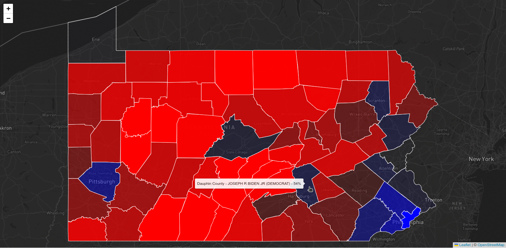

## Practice

In this exercise you'll create a simple choropleth map to display county-level election results in Pennsylvania from the 2020 US presidential election. The data was sourced from the [Harvard Dataverse](https://dataverse.harvard.edu/dataset.xhtml?persistentId=doi:10.7910/DVN/VOQCHQ) (via the [MIT Election Data + Science Lab](https://electionlab.mit.edu/data) clearing house).

1.  Create an account at one of the many map tile providers (for example [Mapbox](https://www.mapbox.com/) or [Stadia](stadiamaps.com)).
2.  Create a new web page and add a Leaflet map using a base layer from your chosen tile provider.
    - Use the Leaflet Quick Start Guide to help you get started. In that guide, the Leaflet CSS and JavaScript files are available from a site called `unpkg.com`. Unpkg is a **CDN** (content delivery network) that hosts many popular libraries and frameworks. You can use it to include Leaflet in your project without downloading it. There are other CDNs that you may see for other libraries, such as [jsDelivr](https://www.jsdelivr.com/), [CDNJS](https://cdnjs.com/), and [Skypack](https://www.skypack.dev/).
3.  Look in the [practice_files/](practice_files/) directory for a GeoJSON file called `pa_pres_results.geojson`. This contains data about county-level election results in Pennsylvania from the 2020 presidential election. Add this data to your map as a GeoJSON layer.
4.  Use the [`bindTooltip`](https://leafletjs.com/reference.html#layer-bindtooltip) function to display the county name when a user hovers over a county.
5.  Add a [`style`](https://leafletjs.com/reference.html#geojson-style) option to the GeoJSON layer to style the color of the counties based on the winning candidate's party. Open the GeoJSON file to get a sense of the properties that are available on each feature, and check the Leaflet [Path Options](https://leafletjs.com/reference.html#path-option) to get a sense for the various properties you can use to style a GeoJSON feature.
6.  Update the features' styles to reduce the filled opacity based on the "evenness" of the vote. For example, if the winning candidate won by a large margin, the county should be more opaque. If the winning candidate won by a small margin, the county should be less opaque.

    The Javascript [`Math`](https://developer.mozilla.org/en-US/docs/Web/JavaScript/Reference/Global_Objects/Math) functions may be useful to you. For example, to get the absolute value of a number, you can use `Math.abs()`. To get the maximum of two numbers, you can use `Math.max()`. To get the minimum of two numbers, you can use `Math.min()`.

As an example, my map looks like this:

## Videos

- Introduction to CSS Layouts - ([video](https://share.descript.com/view/epmjwwWCJPj), ~44 min)
- SVG, Canvas, and Map Accessibility - _Coming Soon_

## References

- MDN Inline Elements - https://developer.mozilla.org/en-US/docs/Web/HTML/Element#inline_text_semantics _(Anything else on that page that's not in the inline text semantics section is a block-level element)_
- Flexbox Froggy - https://flexboxfroggy.com/
- Digital Ocean Flexbox Cheat Sheet - https://www.digitalocean.com/community/cheatsheets/css-flexbox
- CSS Tricks Flexbox Guide - https://css-tricks.com/snippets/css/a-guide-to-flexbox/
- Grid Garden - https://cssgridgarden.com/
- Digital Ocean Grid Layout Intro - https://www.digitalocean.com/community/tutorials/css-css-grid-layout-intro
- Design Patterns for Effective Map UX - https://www.mapuipatterns.com/