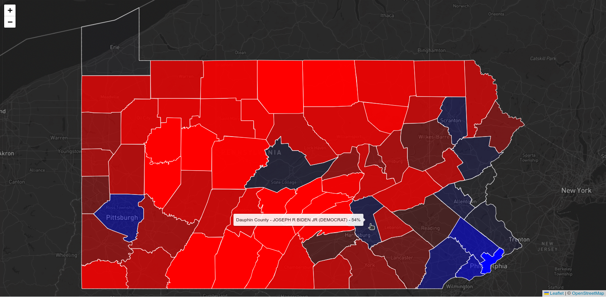

## Before Class...

### Watch

* Intro to Web Maps -- ([video](https://share.descript.com/view/c5q4jtZliwP), ~52min)
* The GeoJSON Data Format -- ([video](https://share.descript.com/view/8DXBwN2Lg67), ~46min)

### Read

From [JavaScript.info](https://javascript.info/):
* Part 1, Chapter 4 -- Objects: the basics **(only section 4.1 is _necessary_, but the rest are _recommended_)**
* Part 1, Chapter 5 -- Data types **(specifically sections 5.2, 5.3, and 5.4 -- the rest are optional, but _recommended_)**

**Optional:** From [Introduction to Web Mapping](https://bgu-geography.com/web-mapping/):
* Chapter 7 -- GeoJSON, https://bgu-geography.com/web-mapping/geojson-1.html

### Practice

* JavaScript Exercises
  * Try to get through at least **parts 2 and 3** of the JavaScript [exercises repository](https://github.com/Weitzman-MUSA-JavaScript/intro-js-exercises).

    > **AI recommendation: DISABLE** -- The exercises in this repository will be absolutely trivial for any AI agent to complete, but that is so far from the point. The goal is for you to start getting comfortable thinking in JavaScript. **I recommend entirely disabling any AI assistance, even auto-complete, while working through these exercises.**

## In Class...

### Review

* **JavaScript Exercises** -- We will review the **basic functions** and **iterators** exercises from the JavaScript [exercises repository](https://github.com/Weitzman-MUSA-JavaScript/intro-js-exercises).

### Practice

In this exercise you'll create a simple choropleth map to display county-level election results in Pennsylvania from the 2020 US presidential election. The data was sourced from the [Harvard Dataverse](https://dataverse.harvard.edu/dataset.xhtml?persistentId=doi:10.7910/DVN/VOQCHQ) (via the [MIT Election Data + Science Lab](https://electionlab.mit.edu/data) clearing house).

1.  Create an account at one of the many map tile providers (for example [Mapbox](https://www.mapbox.com/) or [Stadia](stadiamaps.com)).
2.  Create a new web page and add a Leaflet map using a base layer from your chosen tile provider.
    - Use the Leaflet Quick Start Guide to help you get started. In that guide, the Leaflet CSS and JavaScript files are available from a site called `unpkg.com`. Unpkg is a **CDN** (content delivery network) that hosts many popular libraries and frameworks. You can use it to include Leaflet in your project without downloading it. There are other CDNs that you may see for other libraries, such as [jsDelivr](https://www.jsdelivr.com/), [CDNJS](https://cdnjs.com/), and [Skypack](https://www.skypack.dev/).
3.  Look in the [practice_files/](practice_files/) directory for a GeoJSON file called `pa_pres_results.geojson`. This contains data about county-level election results in Pennsylvania from the 2020 presidential election. Add this data to your map as a GeoJSON layer.
4.  Use the [`bindTooltip`](https://leafletjs.com/reference.html#layer-bindtooltip) function to display the county name when a user hovers over a county.
5.  Add a [`style`](https://leafletjs.com/reference.html#geojson-style) option to the GeoJSON layer to style the color of the counties based on the winning candidate's party. Open the GeoJSON file to get a sense of the properties that are available on each feature, and check the Leaflet [Path Options](https://leafletjs.com/reference.html#path-option) to get a sense for the various properties you can use to style a GeoJSON feature.
6.  Update the features' styles to reduce the filled opacity based on the "evenness" of the vote. For example, if the winning candidate won by a large margin, the county should be more opaque. If the winning candidate won by a small margin, the county should be less opaque.

    The Javascript [`Math`](https://developer.mozilla.org/en-US/docs/Web/JavaScript/Reference/Global_Objects/Math) functions may be useful to you. For example, to get the absolute value of a number, you can use `Math.abs()`. To get the maximum of two numbers, you can use `Math.max()`. To get the minimum of two numbers, you can use `Math.min()`.

    As an example, my map looks like this:

7.  Add a legend to your map that explains the color scheme. You can use the Leaflet [Control](https://leafletjs.com/reference.html#control) class to create a custom control for your legend. There is an example of this in the [Leaflet Tutorials](https://leafletjs.com/examples/choropleth/#custom-legend-control).

This exercise used Leaflet to create a choropleth map. There is a tutorial from Points Unknown that walks through the steps of creating a choropleth map using Mapbox GL JS. You can find that tutorial [here](https://pointsunknown.nyc/web%20mapping/mapbox/python/pandas/geopandas/2021/07/14/08A_WebmappingElectionData.html).

## References

* _JavaScript modules_, from MDN Web Docs - https://developer.mozilla.org/en-US/docs/Web/JavaScript/Guide/Modules
* The GeoJSON Specification, https://datatracker.ietf.org/doc/html/rfc7946
