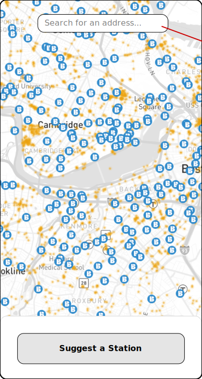
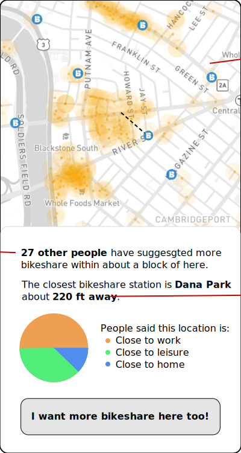
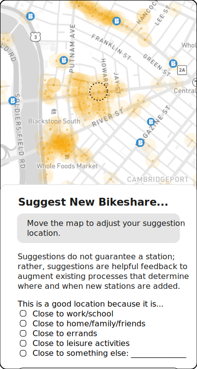
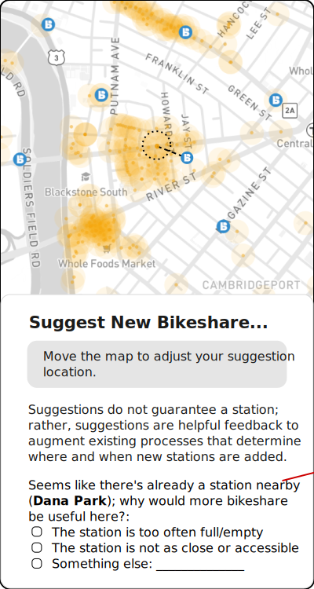

# Bikeshare Station Suggestion App

There were a number of patterns that emerged from the feedback from the cities:
- Cities would be willing to moderate suggestions, but on a very infrequent basis
- Cities would prefer not to have the burden of replying directly to individual suggestions
- Cities would like to know when existing stations have too low capacity, in addition to where new stations should go
- Cities want to be clear that the Lyft tool is one of many, and that the best way to provide direct feedback is by contacting their transportation departments
- Cities want to be clear that suggestions will be considered in aggregate, and a suggestion may not translate to a station
- Cities are constrained by funding mechanisms for new stations; many are tied to developers through transportation demand management agreements, and some have other operational considerations (like removal, storage, and reinstallation of stations around winter months)
- Cities are excited by the potential reach of this tool, even in cases where they have their own

## Initial Proposal Overview

- Match current branding and style for Blue Bikes
- Configure the station suggestion input form and other interaction features
- Determine/design map style and base layers based on existing style guides and Bluebikes apps
- Incorporate existing Bluebikes stations and into the map
- Provide an interface for moderators to hide or otherwise modify suggestions as necessary
- Provide an interface to filter and download suggestion data as necessary

## Updated Proposal Based on Feedback

_Note: The following is not a comprehensive set of features of the map, but should be considered additive to the original proposal, based on the notes from the city partners._

_The data displayed on the mockup maps is from current bikeshare station locations, and Hubway suggestions 2016-2022. The mockups should be considered sketches of the interface and not pixel-perfect goals. Generally, I will aim to match the style of (1) the Bluebikes Style Guide, and (2) the Bluebikes mobile app. Designs will be mobile-first, but responsive for a range of screen sizes._

### Riders: Viewing suggestions on the map

**_Riders should be able to glance at the map and see hotspots of suggestions._**

The default view of the map will show individual locations of suggestions with a buffer of a consistent radius around each suggestion. This will give riders a sense of where suggestions are dense, as overlapping suggestions will create more visible hotspots on the map. In order to avoid overwhelming a user's computer with too many points, we will limit the suggestions shown to a finite number (something like the last 10,000 suggestions) and/or the a finite time period (something like the last 5 years). All of the previous suggestions will be available in the admin interface, but the map will only show a limited number of them.

Clicking on the map will show information about nearby suggestions and stations. Because map interfaces are not great for visual impairments, there will also be an address search box.

**_Riders should be able to click on the map and see a popup with an overview of nearby suggestions and stations._**

In order to relieve city administrators of the burden of moderating content on the platform, we will construct the browsing experience to avoid highlighting any user-generated free text content shared through the interface (i.e. through an "other" field). Instead, when a user clicks on the map, a popup box will give them information about "nearby" suggestions and stations.

### Riders: Leaving suggestions on the map

When a user goes to suggest new bikeshare, the location they’ve selected will show up on the map as a ring with a dotted edge rather than a marker, to communicate that the system does not consider it as an exact location. Further there will be language explaining that the suggestion does not guarantee a station. **That language may include a link to a separate page that contains the contact information for each city’s department that oversees transportation planning.**

There will be only a couple questions that riders will be able to fill out when leaving a suggestion, and neither will be required. If the suggestion is sufficiently far from any existing bikeshare stations (let's say on the order of 100m), then there will be one question asking why the rider thinks the location would be good. If there is already a nearby station, there will be an additional question asking why they are requesting new capacity.

### Riders: Reporting on insufficient station capacity

**_Riders should be able to specify why a new station near an existing one is warranted._**

To keep things conceptually simple, we can limit the number of types of suggestions to one, but when a user starts a new suggestion "near" an existing station, they have an additional question they can answer. For example:

_It looks like the nearest station is pretty close to this one (Dana Park Station is only about 300ft away). Why might a new station be useful?:_

- _That station isn't as close or as accessible as it looks_
- _That station is too often full/empty, and needs more capacity_
- _This is a better location than the existing one_

### Cities: Data hygiene

**_City administrators should be able to click a point and drag to create a circle of a certain radius, and then show or hide all ideas ideas within that circle._**

**_City administrators should be able to click successive points to draw an arbitrary polygon, and then show or hide all ideas ideas within that polygon._**

The admin interface should allow city users to hide a suggestion from the map. Rather than adding in a triage process which the cities are not likely to keep updated, the admin interface should simply allow them to show or hide ideas in bulk. This would allow for things like hiding all suggestions within a certain radius around a newly installed station.

## Overall App Structure

- The app will be a single-page application (SPA) built with vanilla JS, HTML, and CSS
- The app will use an event bus pattern to manage communication between components
- The app will use a back-end as a service (BaaS) platform like Firebase or Supabase for data storage and user authentication
- The app will use a mapping library like Leaflet or Mapbox GL JS for the map interface
- The app will use a geocoding service like Mapbox Geocoding API or OpenCage Geocoder for address search

## Rider Interface Components

- A mobile-first responsive design
- A map that takes up the majority of the screen when the content panel is not open
- A content panel that can slide in and out from the bottom of the screen on mobile, or from the side on desktop
- A search box in the top center for addresses/locations
- A button in the top right for jumping to the user's current location
- A button at the bottom for opening the suggestion form in the content panel

## Rider Interface Interactions

- When the user taps/clicks on the map, the content panel opens with information about nearby suggestions and stations
- When the user searches for an address/location, the map recenters on that location and the content panel opens with information about nearby suggestions and stations
- When the user taps/clicks the "current location" button, the map recenters on their location and the content panel opens with information about nearby suggestions and stations
- When the user taps/clicks the "suggest a station" button, the content panel opens with the suggestion form
- When the suggestion form opens, if the user has not yet selected a location, the form prompts the user to tap/click on the map or use the search box to select a location
- When the user selects a location on the map, the suggestion form updates to show the selected location and the appropriate questions
- When the user submits the suggestion form, the app sends the suggestion data to the back-end for storage
- When a new suggestion is successfully submitted, the map updates to show the new suggestion
- When a new suggestion is successfully submitted, the content panel shows a thank you message and information about how the city will consider their suggestion

### Event bus events to track

- `set-location` - when the user sets the current location -- this can be done through map click, search, or geolocation
- `unset-location` - when the user clears the current location by closing the content panel
- `save-suggestion:submit` - when the user submits a new suggestion
- `save-suggestion:success` - when the suggestion is successfully saved to the back-end
- `save-suggestion:error` - when there is an error saving the suggestion to the back
- `save-suggestion:complete` - when the suggestion save process is complete (either success or error)
