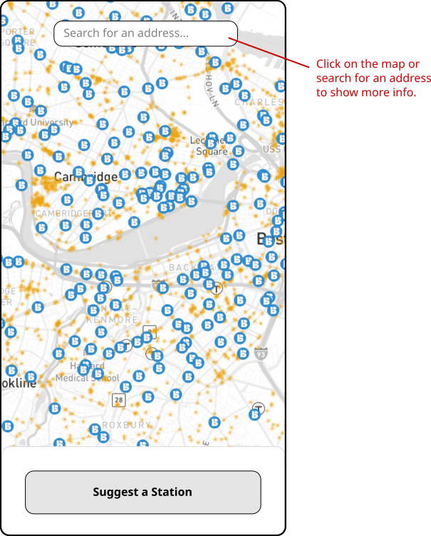
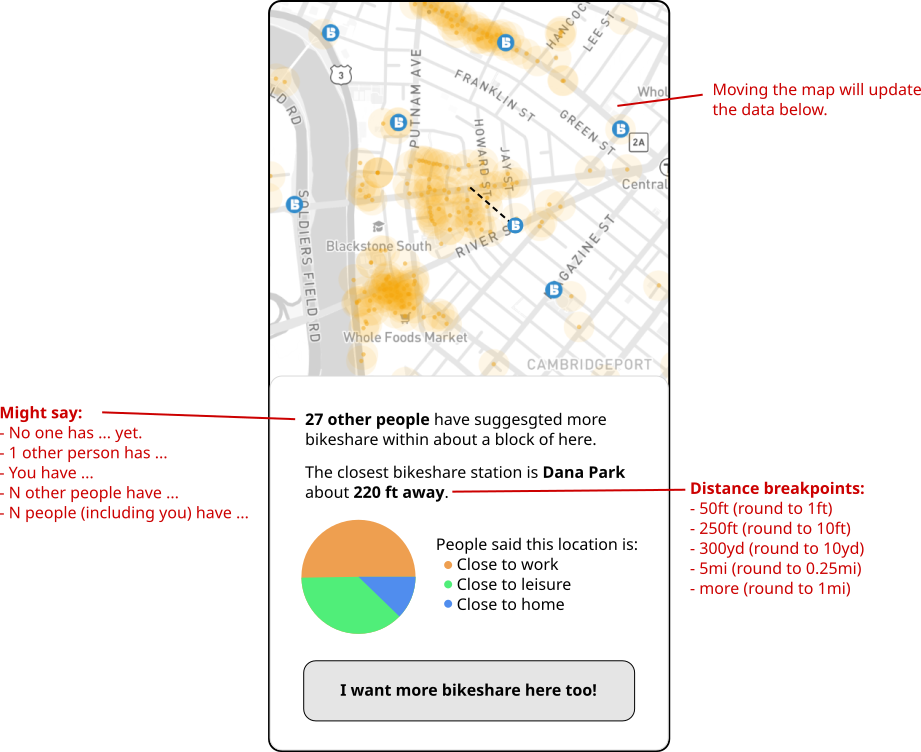
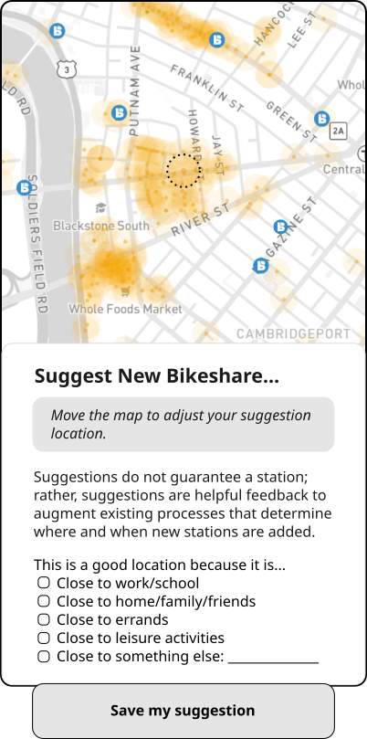
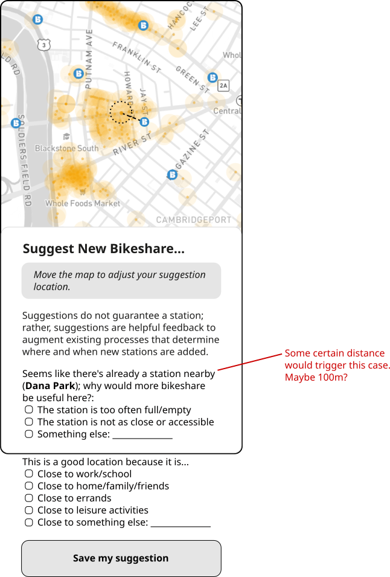

# Bluebikes Suggestion App Proposal

There were a number of patterns that emerged from the feedback from the cities:
- Cities would be willing to moderate suggestions, but on a very infrequent basis
- Cities would prefer not to have the burden of replying directly to individual suggestions
- Cities would like to know when existing stations have too low capacity, in addition to where new stations should go
- Cities want to be clear that the Lyft tool is one of many, and that the best way to provide direct feedback is by contacting their transportation departments
- Cities want to be clear that suggestions will be considered in aggregate, and a suggestion may not translate to a station
- Cities are constrained by funding mechanisms for new stations; many are tied to developers through transportation demand management agreements, and some have other operational considerations (like removal, storage, and reinstallation of stations around winter months)
- Cities are excited by the potential reach of this tool, even in cases where they have their own

## Proposal

### Riders: Viewing suggestions on the map

> **Riders should be able to glance at the map and see hotspots of suggestions.**

The default viwe of the map will show individual locations of suggestions with a buffer of a consistent radius around each suggestion. This will give riders a sense of where suggestions are dense, as overlapping suggestions will create more visible hotspots on the map. In order to avoid overwhelming a user's computer with too many points, we will limit the suggestions shown to a finite number (something like the last 10,000 suggestions) and/or the a finite time period (something like the last 5 years). All of the previous suggestions will be available in the admin interface, but the map will only show a limited number of them.

> **Riders should be able to click on the map and see a popup with an overview of nearby suggestions and stations.**

In order to releive city administrators of the burden of moderating content on the platform, we will construct the browsing experience to avoid highlighting any user-generated free text content shared through the interface (i.e. through an "other" field). Instead, when a user clicks on the map, a popup box will give them information about **"nearby"** suggestions and stations.

### Riders: Leaving suggestions on the map

There will be only a couple questions that riders will be able to fill out when leaving a suggestion, and neither will be required. If the suggestion is sufficiently far from any existing bikeshare stations (let's say on the order of 100m), then there will be one question asking why the rider thinks the location would be good. If there is already a nearby station, there will be an additional question asking why they are requesting new capacity.

### Riders: Reporting on insufficient station capacity

> **Riders should be able to specify why a new station near an existing one is warranted.**

To keep things conceptually simple, we can limit the number of types of suggestions to one, but when a user starts a new suggestion **"near"** an existing station, they have an additional question they can answer. For example:

> It looks like the nearest station is pretty close to this one (Dana Park Station is only about 300ft away). Why might a new station be useful?:
> - That station isn't as close or as accessible as it looks
> - That station is too often full/empty, and needs more capacity
> - This is a better location than the existing one

### Cities: Data hygiene

> **City administrators should be able to click a point and drag to create a circle of a certain radius, and then show or hide all ideas ideas within that circle.**

> **City administrators should be able to click successive points to draw an arbitrary polygon, and then show or hide all ideas ideas within that polygon.**

The admin interface should allow city users to hide a suggestion from the map. Rather than adding in a triage process which the cities are not likely to keep updated, the admin interface should simply allow them to show or hide ideas in bulk. This would allow for things like hiding all suggestions within a certain radius around a newly installed station.